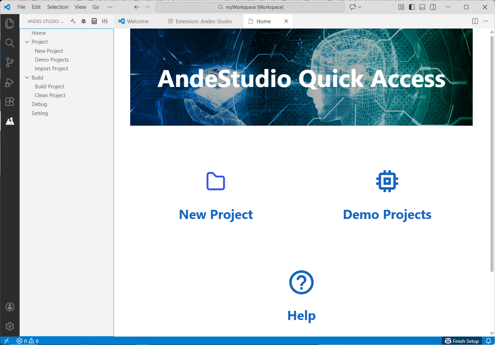

## Requirements 
- **Operating System**: Windows or Linux
- **Software**: Visual Studio Code (version 1.82 or later) installed from [Microsoft Visual Studio Code](https://code.visualstudio.com/download)

## Andes Studio Installation
1. In Visual Studio Code, click  on the **Activity Bar**. 
2. Enter `Andes Studio` in the search box to find the Andes Studio extension. 
3. Select the "Andes Studio" extension and view its README on the right. Click **Install** to start installation.
4. Upon the completion of the installation, the **Andes Studio** icon   appears on the **Activity Bar**. In addition, Andes Studio **Home** view that offers quick access to project creation and demo applications also opens automatically. This verifies the  successful installation. 
   

> **Note**
>
> - If you reinstall or update the Andes Studio extension, restart the Visual Studio Code window to apply the changes. Press **F1**, type `Reload Window` in the Command Palette, select **Developer: Reload Window**, and press **Enter**.
> - On Linux, a system password is required to grant Andes Studio permissions. After installation, follow the on-screen prompt to click **Run** and enter your system password.

## Andes Studio Configuration

Click  at the bottom of the **Activity Bar** and select **Settings**. In the navigation pane, Select **Extensions > Andes Studio** to view the available settings for the Andes Studio extension and modify them if necessary. 

| Setting | Description |
|---------|-------------|
| Package Root | Specifies the installation path of the Andes Studio package | 
| Project Workspace | Specifies the path to the project workspace.| 
| Home Page| Controls whether the Andes Studio Home page is displayed when the extension starts.| 

