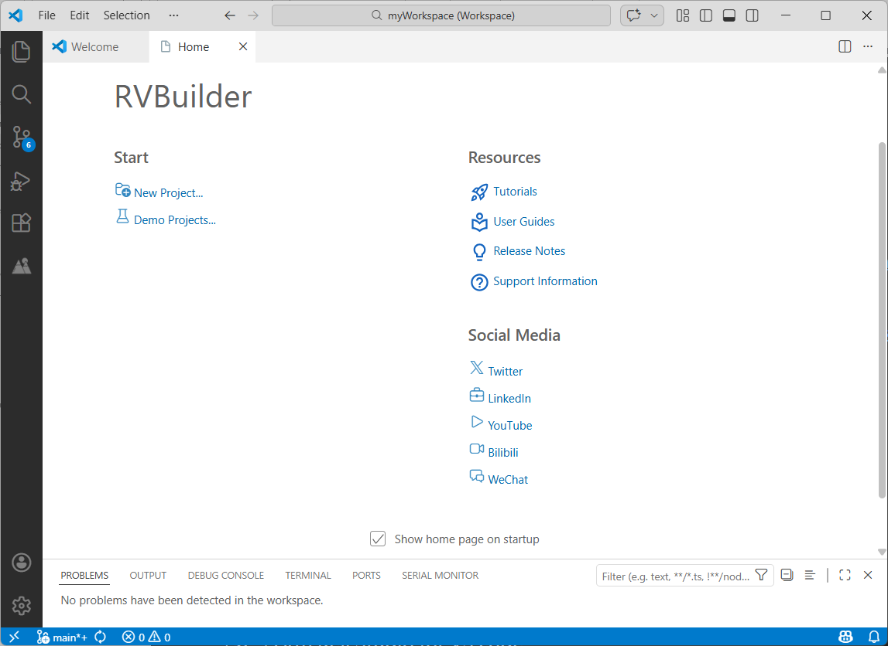

This section outlines the system requirements and provides step-by-step instructions for installing and the RVBuilder extension in Visual Studio Code, including notes on updates and platform-specific considerations.

## Requirements 
- **Operating System**: Windows or Linux
- **Software**: Visual Studio Code (version 1.82 or later) from [Microsoft Visual Studio Code](https://code.visualstudio.com/download)

## RVBuilder Installation
1. In Visual Studio Code, click  on the **Activity Bar**. 
2. Enter `RVBuilder` in the search box to find the RVBuilder extension. 
3. Select the "RVBuilder" extension and view its details on the right. Click **Install** to start installation.
4. Upon the completion of the installation, the **RVBuilder** icon  appears on the **Activity Bar**. In addition, the RVBuilder **Home** page that offers quick access to project creation and demo applications also opens automatically. This verifies the  successful installation. 

> **Note**
>
> - If you reinstall or update the RVBuilder extension, restart Visual Studio Code or reload its window to apply the changes. To reload VS Code window, press **F1**, type `Reload Window` in the Command Palette, select **Developer: Reload Window**, and press **Enter**.
> - On Linux, a system password is required to grant RVBuilder permissions. After RVBuilder installation, follow the on-screen prompt to click **Run** and enter your system password.

