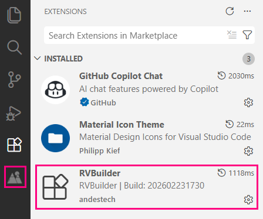
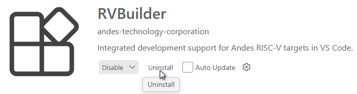
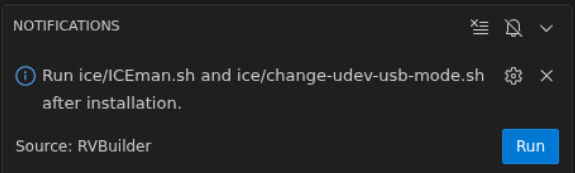
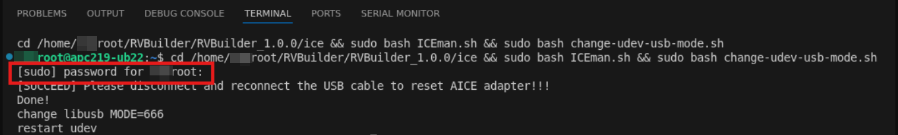

This section outlines the system requirements, installation instructions for the RVBuilder extension in Visual Studio Code, and the extension configuration. 

## Requirements 
- **Operating System**: Windows or Linux
- **Software**: Visual Studio Code (version 1.82 or later) from [Microsoft Visual Studio Code](https://code.visualstudio.com/download)

## RVBuilder Installation
1. Download the RVBuilder extension package `rvbuilder-1.0.0.vsix` from the [RVBuilder lastest release page](https://github.com/andestech/RVBuilder/releases/tag/v1.0.0).  
2. In Visual Studio Code, click  in the **Activity Bar**. 
3. In the **Extensions** view, click the **More Actions** icon  in the top-right corner, select "Install from VSIX…" from the drop-down menu, and then choose the downloaded file `rvbuilder-1.0.0.vsix` to start the installation. 
4. After the completion of installation, RVBuilder appears in the list of installed extensions in the **Extensions** view and the **RVBuilder** icon  is displayed in the **Activity Bar**. These indicate that the installation was successful.

    

---
 **Note**

  - To reinstall or update the RVBuilder extension, uninstall the existing extension before proceeding. After reinstallation, restart VS Code to apply the changes. 

     

  - On Linux, a system password is required to grant RVBuilder permissions. After RVBuilder installation, follow the on-screen prompt to click **Run** and enter your system password.

    
    

---

## Extension Configuration

Click  at the bottom of the **Activity Bar** and select **Settings**. Under the **User** tab, select **Extensions > RVBuilder** in the navigation pane to view the available RVBuilder extension settings and modify them if necessary. 

| Setting | Description |
|---------|-------------|
| Home Page| Controls whether the RVBuilder Home page is displayed when the VS Code starts. |
| Package Root | Specifies the installation destination of the RVBuilder package components.
| Project Workspace | Specifies the path to the project workspace.|

