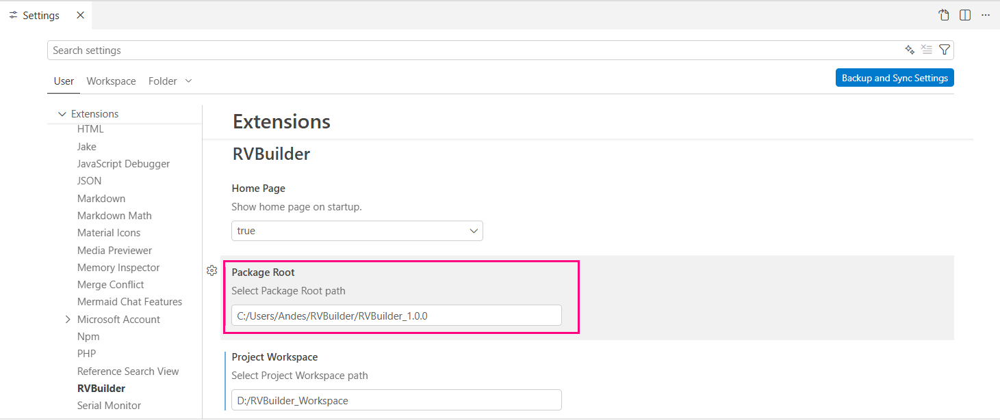

This section outlines the system requirements and provides step-by-step instructions for installing and the RVBuilder extension in Visual Studio Code, including notes on updates and platform-specific considerations.

## Requirements 
- **Operating System**: Windows or Linux
- **Software**: Visual Studio Code (version 1.82 or later) from [Microsoft Visual Studio Code](https://code.visualstudio.com/download)

## RVBuilder Installation
1. Download the RVBuilder extension package `rvbuilder-1.0.0.vsix` from the [Andes GitHub RVBuilder repository](https://github.com/andestech/rvbuilder).  
2. In Visual Studio Code, click  in the **Activity Bar**. 
3. In the **Extensions** view, click the **More Actions** icon  in the top-right corner, select "Install from VSIX…" from the drop-down menu, and then choose the downloaded file `rvbuilder-1.0.0.vsix` to start the installation. 
4. After the completion of installation, RVBuilder appears in the list of installed extensions in the **Extensions** view and the **RVBuilder** icon  is displayed in the **Activity Bar**. These indicate that the installation was successful.

  

**TO-DO: Update RVbuilder_Install Verify screenshot - include RVbuilder icon and RVbuilder as installed extension** 

---
 **Note**

  - To reinstall or update the RVBuilder extension, uninstall the currently installed RVBuilder package before proceeding. The package installation path can be found in VS Code under **Settings > Extensions > RVBuilder** (User scope).  

    

     After reinstalling, restart VS Code or reload the window to apply the changes. To reload VS Code window, press **F1**, type `Reload Window` in the Command Palette, select **Developer: Reload Window**, and press **Enter**.

  - On Linux, a system password is required to grant RVBuilder permissions. After RVBuilder installation, follow the on-screen prompt to click **Run** and enter your system password.

    
    

---
