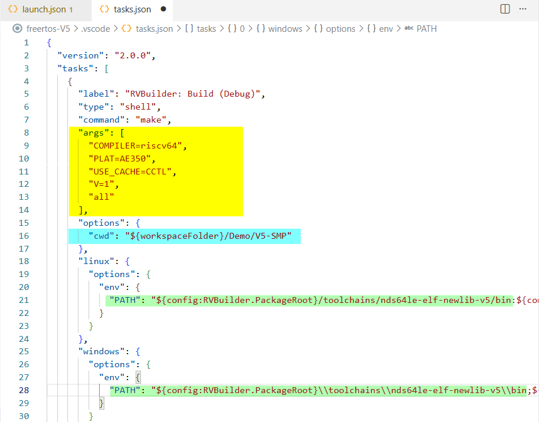
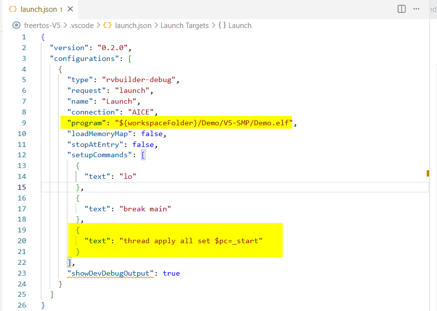

The RVBuilder package provides two demo applications, `demo-plic-novector-V5` and `freertos-V5`, to demonstrate the development workflows with RVBuilder in VS Code. For detailed descriptions of their demo scenarios, see [**Demo Applications**](./using_rvbuilder.md#demo-applications). 

The two demos are executed in a similar manner, but they use different approaches to manage build configuration and tasks.

- The `demo-plic-novector-V5` project uses the RVBuilder-generated Makefile, allowing build and debug settings to be managed directly through the RVBuilder interface. 
- The `freertos-V5` project uses a custom Makefile and requires manual modification of the workspace configuration files (`tasks.json` and `launch.json`) for the build and debug process.

The following sections use the two demo applications to illustrate the typical development workflows with RVBuilder.

## Development Workflow with RVBuilder-Generated Makefile 
The `demo-plic-novector-V5` project is used here to demonstrate the development workflow for projects that use a Makefile generated by RVBuilder. 

### Import a Demo Project 
1. Click  on the **Activity Bar** to open the **RVBuilder** view and click **Home**.
2. Click **Demo Projects...** on the RVBuilder **Home** page.
3. On the opened dialog, select the `demo-plic-novector-V5` project and click **Import**. 
4. See the demo project in the **Explorer** view. 

### Configure and Build the Project 
1. Right-click the project in the **Explorer** view and select "RVBuilder: Build Project". 
2. In the **Project Settings**, select a chip profile and a connection type that correspond to your target system and target environment.
3. Ensure the option "Use RVBuilder-Generated Makefile" is checked and specify respective build settings as needed.  
4. Click the **Build** button to build the application. 
5. Verify the program executable `demo-plic-vector-V5.adx` is generated in the project. 

### Run or Debug the Project 
1. Right-click the project in the **Explorer** view and select "RVBuilder: Debug". 
2. In the command palette, select the launch configuration for demo-plic-novector-V5. 
3. The debug session starts. Use the **Debug toolbar** to control program execution. 
4. Inspect the program runtime data, such as CPU register values and variable values, in the **Run and Debug** view. 

## Development Workflow with Custom Makefile
The `freertos-V5` project is used here to demonstrate the development workflow for projects that use a custom Makefile. Note that the project includes two standard FreeRTOS applications, **Full** and **Blinky**, and the **Full** demo is not supported on simulator targets. 

### Import a Demo Project 
1. Click  on the **Activity Bar** to open the **RVBuilder** view and click **Home**.
2. Click **Demo Projects...** on the RVBuilder **Home** page.
3. On the opened dialog, select the `freertos-V5` project and click **Import**. 
4. See the demo project in the **Explorer** view. 

### Specify a FreeRTOS Demo (and Configure for SMP Target)
1. In the **Explorer** view, locate the directory `${PROJECT_ROOT}/Demo/[V5|V5-CLIC|V5-SMP]/RTOSDemo`. 
2. Open `main.c` and search for the definition `mainSELECTED_APPLICATION`. Set its value to `0` to build the **Blinky** demo, or `1` to build the **Full** demo.  
3. (For SMP targets only) Open `FreeRTOSConfig.h` in the same directory and update the `configNUMBER_OF_CORES` value to match the number of cores on your SMP target. 

### Configure Build Settings in `tasks.json` 
1. Open `tasks.json` under `${PROJECT_ROOT}/.vscode`. 
2. In the `args` section, specify make arguments for the project: 

    | Make Argument | Valid Value & Description|
    |---------------|-------------|
    | `COMPILER` | &bull; `riscv32`: Specifies the GCC compiler using a 32-bit toolchain. &bull; `riscv64`: Specifies the GCC compiler using a 64-bit toolchain. &bull; `riscv32-llvm`: Specifies the LLVM compiler using a 32-bit toolchain. &bull; `riscv64-llvm`: Specifies the LLVM compiler using a 64-bit toolchain. |
    | `PLAT` | &bull; `AE350`: Specifies AE350 as the target platform.|
    | `USE_CACH` | &bull; `0`: disable the cache and its operation. &bull; `CCTL`: Uses Andes CCTL extension when supported. &bull; `CMO`: Uses RISC-V CMO extension when supported.|
    | `V` | &bull; `1`: Enables a verbose build.|
    | `EXTRA_CFLAGS=-mcpu` & `EXTRA_LDFLAGS=-mcpu`  (Optional) | &bull; `ax65`: Enables AX65-related features in the toolchains. &bull; `ax46`: Enables AX65-related features in the toolchains. &bull; `a46`: Enables AX65-related features in the toolchains. &bull; `d23`: Enables AX65-related features in the toolchains. &bull; `n225`: Enables AX65-related features in the toolchains.|
    | `all` | Compiles all source files and generates the final output.|

3. Search for `cwd` and set the build directory path to where the Makefile for your target locates, which is `${PROJECT_ROOT}/Demo/[V5|V5-CLIC|V5-SMP]/`.
4. Update all toolchain executable paths in the file according to the toolchain to be used for your target. The path is 
   - `{RVBUILDER_PACKAGE_ROOT}/toolchains/nds32le-elf-newlib-v5/bin/` for an Andes 32-bit processor, and
   - `{RVBUILDER_PACKAGE_ROOT}/toolchains/nds64le-elf-newlib-v5/bin/` for an Andes RISC-V 64-bit processor. 

### Configure Launch Settings in `launch.json` 
1. Open `launch.json` under `${PROJECT_ROOT}/.vscode`.
2. Search for `Program` and set the program executable path to `${workspacefolder}/Demo/[V5|V5-CLIC|V5-SMP]/Demo.elf`.
3. (For SMP targets only) Add GDB command `thread apply all set $pc=_start` to the `setupCommands` section. 

### Specify Target Configuration and Build  
1. Right-click the project in the **Explorer** view and select "RVBuilder: Build Project".
2. In the **Project Settings**, select a chip profile and a connection type that correspond to your target system and target environment. As the Full demo is not supported on simulator targets, make sure not to select "Andes QEMU" as its connection type. 
3. Click the **Build** button to build the application. 
4. Verify the program executable `Demo.elf` is generated in the build directory `${workspacefolder}/Demo/[V5|V5-CLIC|V5-SMP]`. 

### Run or Debug the Project 
1. Right-click the project in the **Explorer** view and select "RVBuilder: Debug". 
2. In the command palette, select the launch configuration for freertos-V5. 
3. The debug session starts. Use the **Debug toolbar** to control program execution. 
4. Inspect the program runtime data, such as CPU register values and variable values, in the **Run and Debug** view. 

