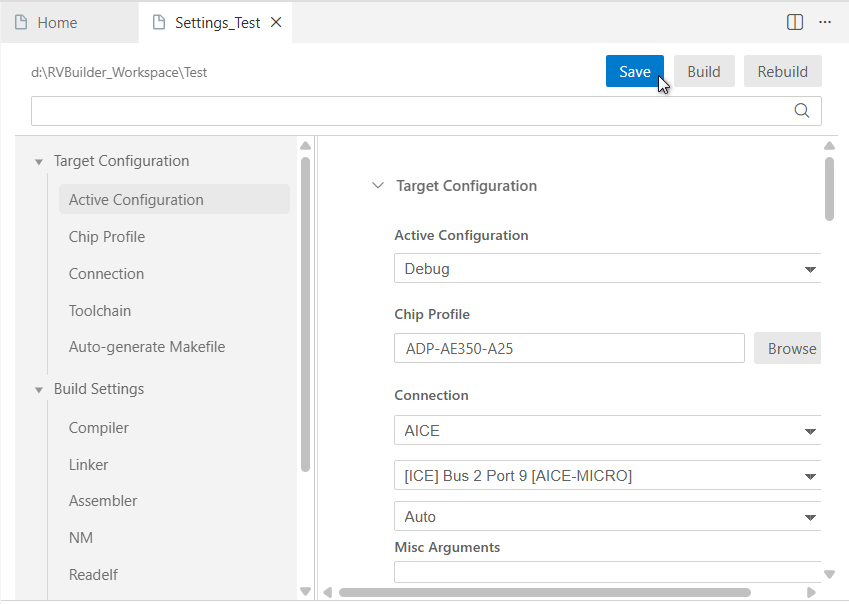
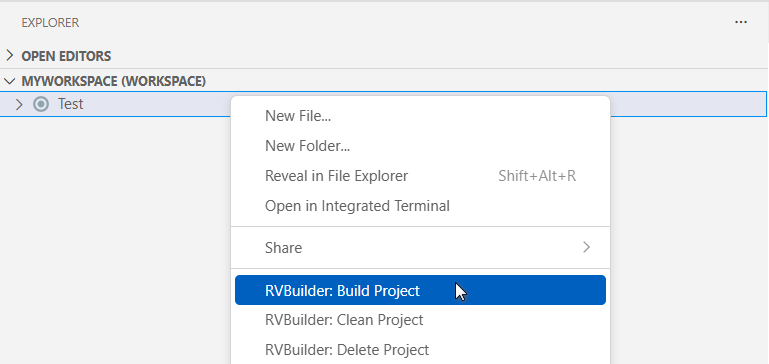
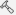
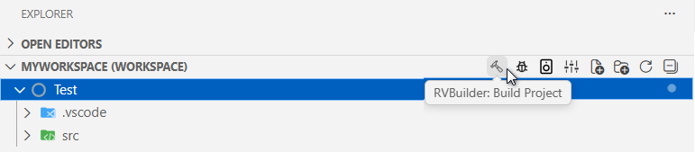
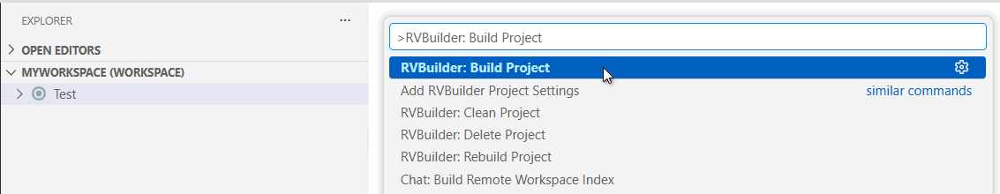
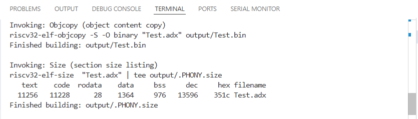
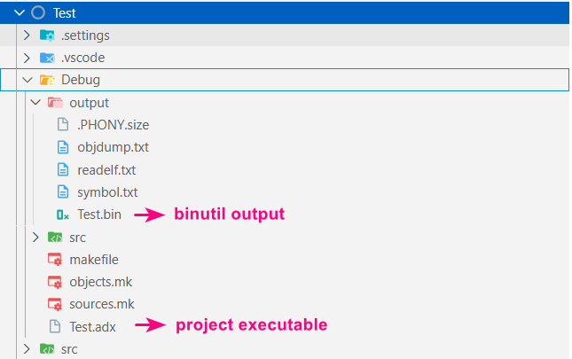

This section describes how to build an RVBuilder project in VS Code. It covers the available build methods, where the build output is displayed, and where the generated artifacts are located for single-core and multi-core Andes RISC-V targets.

## Build Methods 
With the project selected in the **Explorer** view, use either of the following ways to initiate the build process of an RVBuilder project.

 - On the project's **Settings** page, click "Build" in the upper-right corner. 
    

 - On the project's drop-down menu, click "RVBuilder: Build Project".
    

 - On the **Explorer** view title menu, click  (RVBuilder: Build Project).  
    

 - In the command palette (opened using the keyboard F1 or Ctrl+Shift+P), run the "RVBuilder: Build Project" command.  
    

 ---
 **Note**

If you use a self-defined `tasks.json` for an RVBuilder project, start the build process using the “Tasks: Run Task” command from the command palette. This invokes VS Code’s native task runner to execute the build task defined in `tasks.json`.

---

## Build Output 
The build process and result are displayed in the **Terminal** view. 

 

## Build Artifacts 
The build artifacts are generated in the following locations:

- **Program executable** (`.adx`) and **object files**: `${PROJECT}/[Debug|Release]` 
- **Binutils outputs** (e.g. `.bin`): `${PROJECT}/[Debug|Release]/output`. 

 