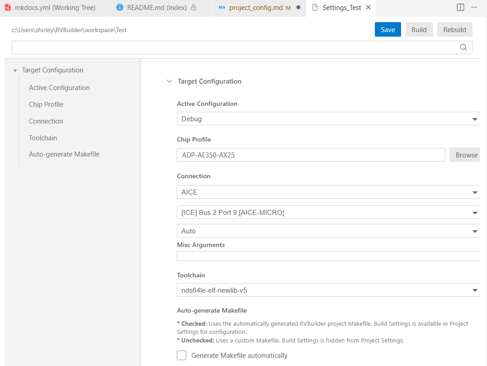
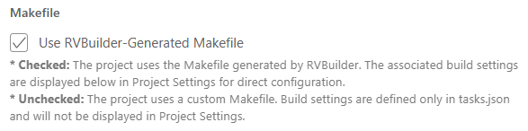
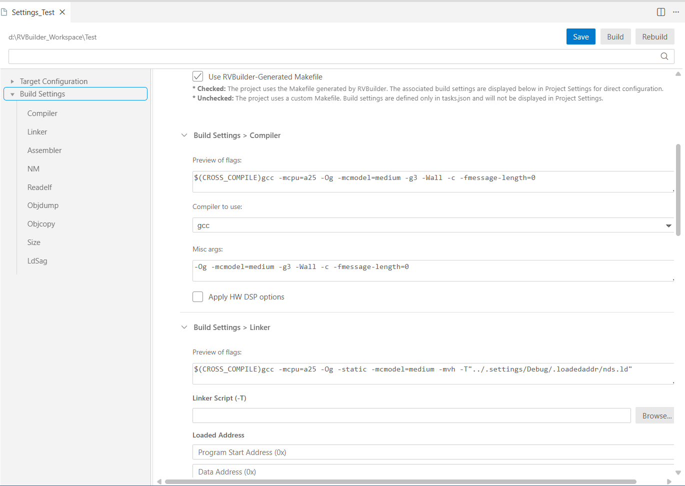

RVBuilder provides a graphical user interface (GUI) for configuring target and build settings for a project. The configuration interface can be opened by right-clicking the project in the **Explorer** view and selecting "RVBuilder: Settings" from the drop-down menu.

## Target Configuration

| Configuration Option | Description | Notes |
|----------------------|------------|-------|
| **Active Configuration** | Selects the build configuration for the project. Available options include **Debug** and **Release**. | |
| **Chip Profile** | Specifies the chip profile associated with the target. The chip profile defines the target specifications and corresponding software configuration files. | See [**Chip Profiles**](./using_rvbuilder.md#chip-profiles). |
| **Connection** | Specifies the target connection type used for development. Supported connection types include **AICE**, **Andes QEMU**, **Maverick**, and **GDB server**. For details of the connection types, see **[Target Connection](./targets.md#target-connection)**. |   For local target connections, additional options can be specified in the **Misc Arguments** field. See [Andes QEMU Emulator Reference Manual](./ref/Andes_QEMU_Emulator_Reference_Manual_UM284_V1.2.pdf) and [Andes ICE Management Software (ICEman) User Manual](./ref/Andes_ICE_Management_Software_UM067_V4.1.pdf) for available options for Andes QEMU or AICE connection.  For AICE connection, also take note of the following: 1. RVBuilder automatically detects and displays the plugged-in ICE device along with its position. If multiple local ICE devices are detected, they are listed together for selection. 2. When using an AICE-MINI+, AICE-T2 or AICE-MICRO ICE box, you must specify the debug interface of the target board. Available options include &bull; **Auto**: Tries the JDP mode first. If it fails, use the SDP mode. &bull; **SDP (2-wire)**: Uses the SDP mode (with 2-wire debug interface). &bull; **JDP (4-wire)**: Uses the JDP mode (with 4-wire debug interface) |
| **Toolchain** | Displays the toolchain selected for the target. | See [**Toolchains**](./using_rvbuilder.md#toolchains). |

## Makefile 
The **Makefile** section specifies whether the project uses the Makefile automatically generated by RVBuilder. 

- **Use RVBuilder-Generated Makefile**: When checked, the project uses the Makefile generated by RVBuilder, allowing build settings to be managed directly through the **Project Settings** interface. If the project uses a custom Makefile, uncheck this option. 
    

## Build Settings
For a project configured to use the RVBuilder-generated Makefile, RVBuilder displays the build settings in the **Project Settings** interface. You can configure the compiler, linker, assembler, GNU Binutils (NM, Readelf, Objdump, Objcopy, Size), and linker script generator (LdSaG) directly in **Project Settings**.

For most build tools or utilities in the **Build Settings** section, their configuration interface includes:

  - **Preview of flags**: Displays the complete command-line options currently applied to the tool or utility.
  - **Misc Args**: Allows you to specify additional or specialized options for the tool or utility. For the options supported by the selected toolchain, see [**Toolchains**](./using_rvbuilder.md#toolchains).

The interface also includes additional configuration settings for certain tools and utilities, as outlined below. 

### Compiler 

- **Compiler to use**: Specifies the compiler to use for the build. Available options include GCC and LLVM. 
- **Apply HW DSP options**: When selected, applies compiler and linker options that enable the DSP ISA extension supported by the target.  

### Linker 

- **Linker Script (-T)**: Specifies a custom linker script for the target. This field is overwritten and shown as `$(LDSAG_OUT)` when the LdSaG tool is enabled (i.e., when the **Generate linker script** option in the **LdSaG** settings is selected).
- **Loaded Address**: Specifies the memory addresses used when loading the program image. This section is only available when a custom linker script (i.e., not generated by LdSaG) is used. 
    - **Program Start Address (0x)**: Specifies the start address of the program in target memory. 
    - **Data Address (0x)**: Specifies the start address of the program data in target memory. 
    - **Stack Address (0x)**: Specifies the start address of the stack in target memory. 
- **Libraries (-l)**: Specifies additional libraries to link with the program. Multiple libraries can be added using the **Add** button.

### LdSaG Tool 

- **Generate linker script**: Enables generation of a linker script based on the specified image layout description file written in Andes Scattering-and-Gathering (SaG) syntax. 
- **Linker script template**: Specifies the linker script template used by the LdSaG tool. The default template for Andes RISC-V targets is `nds32_template_v5.txt` in the RVBuilder package. 
- **SaG file**: Specifies a SaG description file (`*.sag`) that defines the memory layout for a RISC-V program. 
- **Other flags**: Optionally, specifies LdSaG options to control the linker script generation process. 

For details about the LdSaG tool, see [**Linker Script Generator**](./using_rvbuilder.md#linker-script-generator).