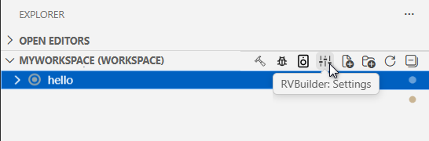
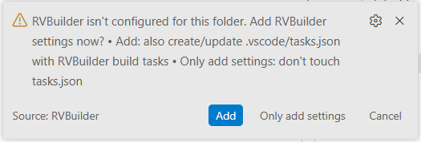

## Start a New RVBuilder Project 

1. In Visual Studio Code, click  to open the **RVBuilder** view and click **Home**. 
2. On the RVBuilder **Home** page, click **New Project**. 
3. On the **New Project** dialog, enter a project name, specify a programming language (C or C++), a desired Andes RISC-V target and a project type, and then click **Browse** to specify a project workspace location.

    !!! note
        Andes RISC-V targets are defined by chip profiles. For more about chip profiles in the RVBuilder package, see [**Chip Profiles**](./using_rvbuilder.md#chip-profiles).

4. Click **Create** to complete the project creation.

## Add RVBuilder Settings to an Existing Project 

For an existing project created in a non-RVBuilder environment, you can enable it to have RVBuilder settings and features to streamline development on Andes RISC-V targets. Proceed as follows:

1. In the **Explorer** view, add an existing project folder to the current workspace. 

2. Right-click the project folder and select any [RVBuilder project action item](./using_rvbuilder.md#4-rvbuilder-project-action-items) — except "RVBuilder: Delete Project" — from either the project drop-down menu or the **Explorer** view title menu.

    For example, select an existing "hello" project and click the **RVBuilder: Settings** button on the **Explore** view title menu.
    

3. A notification dialog appears indicating that the project is not yet configured for development with RVBuilder. Click **Yes** to add the RVBuilder settings to the project.
   
    

4. The project is now configured as an RVBuilder project. RVBuilder features such as build, debug, and flash operations dedicated for development with Andes RISC-V targets are enabled, and the project is ready for development using the RVBuilder workflow.
