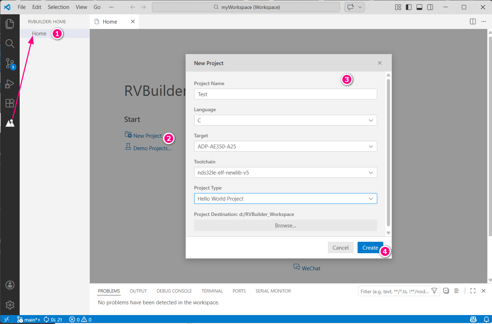

## Starting a New Project 

1. In Visual Studio Code, click  to open the RVBuilder view and click **Home**. 
2. On the RVBuilder **Home** page, click **New Project**. 
3. On the **New Project** dialog, enter a project name, specify a programming language (C or C++), a desired Andes RISC-V target and a project type, and then click **Browse** to specify a project workspace location.

    !!! note
        Andes RISC-V targets are defined by chip profiles. For more about chip profiles in the RVBuilder package, see [**Chip Profiles**](./components.md#chip-profiles).

4. Click **Create** to complete the project creation.
 

## Adding RVBuilder settings to an Existing Project 