This section describes how to debug applications for Andes RISC-V targets using RVBuilder in VS Code. It covers the preparations for a debug session, how to initiate and control a debug session, and the views to inspect program state ahd target status during debugging. 

## Before Debugging  
### Install Required Extensions 
RVBuilder leverages VS Code’s native debugging capabilities, together with additional extensions, to provide comprehensive debug support for Andes RISC-V targets. Before you start a debug session, search and install the following extensions required for debugging in the **Extensions** view:

- **Eclipse CDT Cloud Memory Inspector**: For monitoring and modifying memory values.  
   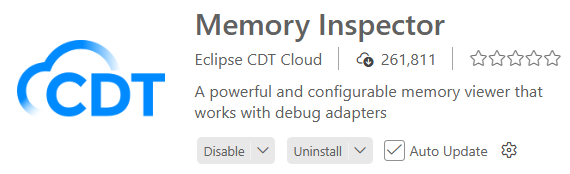

- **Serial Monitor**: For viewing outputs from serial ports of Andes RISC-V targets. 
   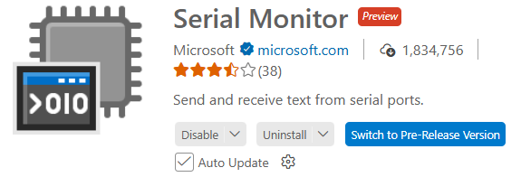

### Set Breakpoints (Optionally)
Set breakpoints to pause program execution and inspect the application at specific points. For how to set breakpoints in VS Code, see [**Breakpoints**](https://code.visualstudio.com/docs/debugtest/debugging#_breakpoints). 

## Start Debugging
1. Use either of the following ways to initiate a debug process of an RVBuilder project.

    - In the **Explorer** view, select the desired project, click "RVBuilder: Debug" on the project's drop-down menu and run the launch configuration for the project in the invoked command palette. 
    
        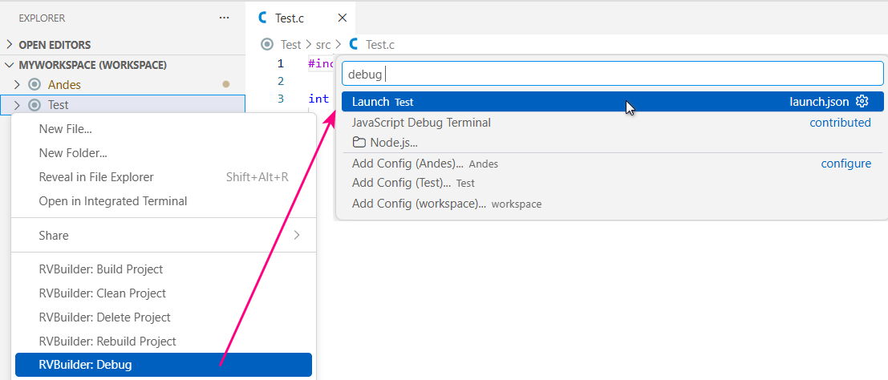

    - In the **Run and Debug** view, select the launch configuration for the desired project from the combo box and click  to launch the debug session. 
    
        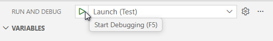

2. The debug session starts. 

    - For ICE targets (AICE or Maverick targets), view debugging outputs from the **Debug Console** panel.
        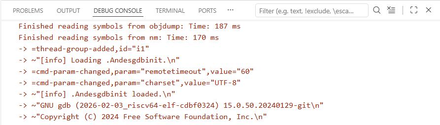

    - For simulator targets (Andes QEMU targets), the output messages are printed to a **gdb-server** terminal. 
        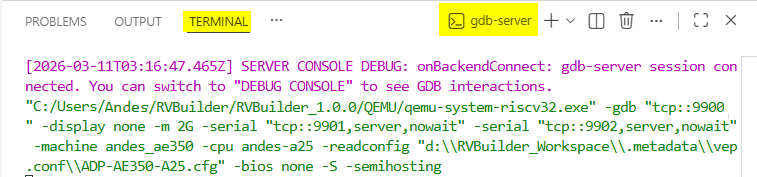

3. Use the **Debug toolbar** to control the flow of the debug session, such as stepping through code or pausing execution. 

     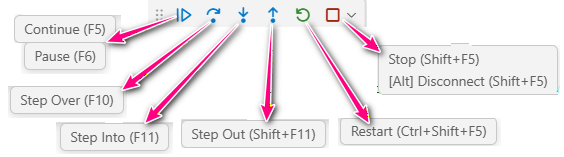 

    The available debug actions from the toolbar include
   
    | Action | Description |
    |--------|-------------|
    | Continue/Pause | Continue: Resume program execution. Pause: Suspend program execution. |
    | Step Over | Execute the next statement without inspecting or following its component steps.|
    | Step Into | Enter the next statement to follow its execution line-by-line. |
    | Step Out | When inside a function, return to the earlier execution context. |
    | Restart | Terminate the current program execution and start debugging again using the current configuration. |
    | Stop/Disconnect | Stop: Terminate the current program execution. Disconnect: Detach debugger from a core without changing the execution status (running/pause). |

4. During debugging, examine runtime information such as program variables, CPU/pheripheral register values, and stack frames in the **Run and Debug** view. 

## Inspect Runtime Data
In a debug session, you can monitor the real-time state of your application and target across various sections of the **Run and Debug** view and other debugger-related views.

### Variables

The **Variables** section displays the current values of program variables at the active stack frame. It is organized into the following parts:

- **Local**: Shows variables defined within the current function.

- **Global**: Shows variables accessible throughout the program.

- **Static**: Shows variables that retain their value between function calls.

- **Registers**: Shows CPU registers used during program execution.

Variable values in the section are updated automatically during debugging. You can right-click a variable or CPU register in the section and select "Set Value" to edit its value. 

 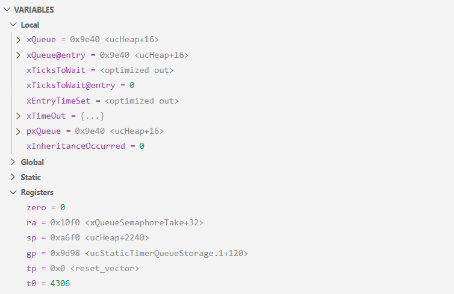 

### Watch

The **Watch** section allows you to evaluate and watch variables and expressions. To watch a variable or expression, use either of the following methods:
 
- Click the + icon in the title bar of the **Watch** section and enter the exression name. 

- Right-click a variable or expression in the code editor and select "Add to Watch". 

- Right-click a variable within the **Variables** section and select "Add to Watch".

 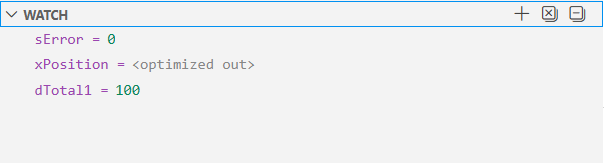 

### Call Stack

The **Call Stack** section shows the hierarchy of active function calls at the current execution point. It displays the current function when the execution paused, the call sequence to reach the current state, and the associated source files and line numbers. Selecting a different stack frame in the section allows you to jump to the corresponding line in the source code and updates data in the **Variables** section to reflect the context of that frame.

 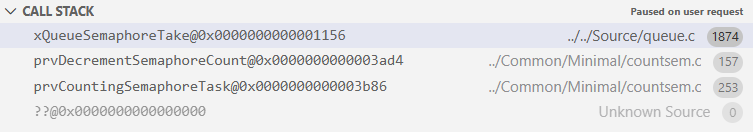 

### Disassembly

The **Disassembly** view displays the machine instructions for the selected stack frame or current program counter (PC). It shows the instruction address, the function symbol with offset, the opcode/decoded assembly mnemonic, and marks the current PC with a highlighted row. You can view disassembled instructions alongside source code and step through them for detailed program analysis. To open the view, right-click a stack frame in the **Call Stack** section and select "Open Disassembly View". 

 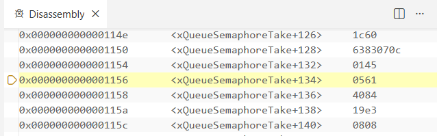 

### Breakpoints

The **Breakpoint** section displays all breakpoints set for the current project. You can manage breakpoints directly in this section by enabling, disabling, or removing them as needed.

 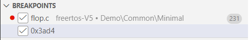 

### RVBuilder SoC Registers

The **RVBuilder SoC Registers** section displays the runtime status of System-on-a-Chip (SoC) registers for RVBuilder projects. These registers are organized hierarchically by peripheral, with each entry showing the base address, register offset, and current value. Bit fields are also decoded for easier inspection. SoC register values are updated in this section during debugging, enabling direct observation and verification of peripheral states.

 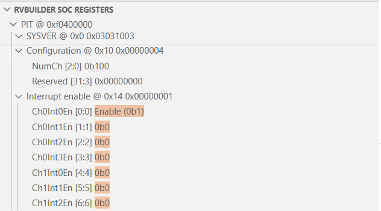 

### Memory Inspector 

The **Memory Inspector** view is available after installing the **Eclipse CDT Cloud Memory Inspector** extension. It enables inspection of memory regions on a target in a debug session. It allows you to navigate to a specified memory address, view memory data in various formats, adjust display settings, and modify memory content if needed. 

To open the view, press F1 and run "Memory: Show Memory Inspector" from the command palette, or right-click a variable in the **Variables** section and select "Show in Memory Inspector".

 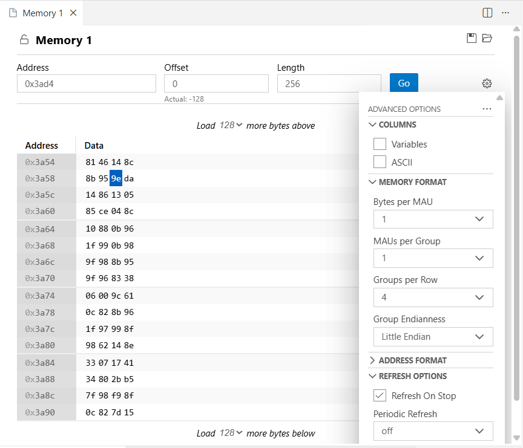 

### Serial Monitor

The **Serial Monitor** terminal is available after installing the **Serial Monitor** extension. It provides real-time monitoring of serial or TCP outputs from your application during execution.

 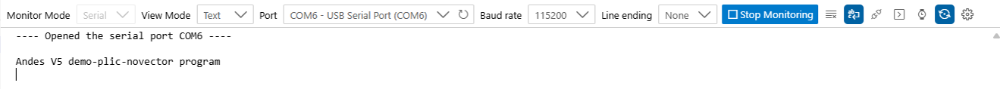 

For Andes RISC-V targets connected through AICE/Maverick/GDB server, select **Serial** as the monitor mode, specify the serial port and baud rate, and click the **Start Monitoring** button to establish the serial connection and view outputs from the target. Then, click the **Stop Monitoring** button to end the monitoring session.  

For Andes RISC-V targets running on Andes QEMU, select **TCP** as the monitor mode, set **Host** to `localhost`, and enter the TCP port number corresponding to UART2 before clicking **Start Monitoring**. The UART2 TCP port number can be obtained from the first TCP port displayed in the QEMU target connection log (e.g., `9901` in the example below.) 
 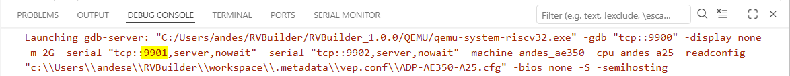 

