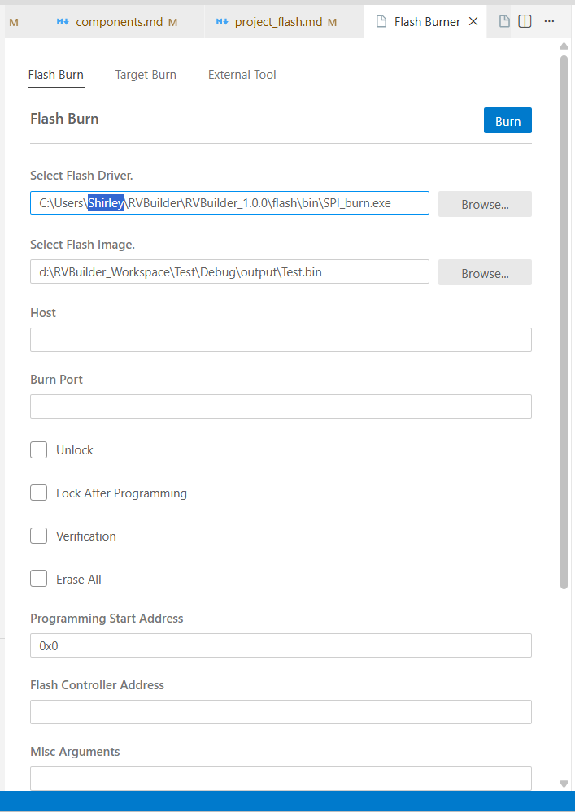

For Andes RISC-V ICE targets connected via AICE or Maverick (locally or remotely), RVBuilder provides a dedicated graphical interface for programming application binaries into the target flash memory. 

## Start Programming 
To perform in-system programming using RVBuilder, proceed as follows:

1. In the **Explorer** view, right-click the project and select "RVBuilder: Flash Burner" on the drop-down menu. 

2. In the opened **Flash Burner** settings UI, select the tab corresponding to your programming approach and configure the programming options. For details about the programming approaches supported by RVBuilder, see [**Flash Burner**](./using_rvbuilder.md#flash-burners). 

3. Click the **Burn** button in the upper-right corner to start flash programming.

## Flash Programming Configuration

The following describes the configuration options available in the **Flash Burner** UI for each programming approach in its corresponding tab. The RVBuilder package includes the flash burners and target applications required for the **Flash Burn** and **Target Burn** approaches (see [**Flash Burner**](./using_rvbuilder.md#flash-burners)). To use a self-defined flash burner, go to the **Custom Burner** tab. 

### Flash Burn

| Configuration Option | Description |
|---------|-------------|
| Flash Burner| Specifies the flash burner `PAR_burn` to program parallel flash or `SPI_burn` to program the SPI flash. |
| Flash Image | Specifies the binary image to be programmed to the flash memory. |
| Host | Specifies the name or IP address of the remote host. Required only for remote Andes RISC-V ICE targets connected via GDB server. |
| Burner Port| Specifies a socket port for the burner to connect. Required only for remote Andes RISC-V ICE targets connected via GDB server.|
| Unlock | Unlocks the flash memory before burning. |
| Lock After Programming| Locks the flash memory after programming. |
| Verification | Verifies the result after programming. |
| Erase All | Erases the entire flash segment to perform programming. |
| Programming Start Address | Specifies the start address to be programmed. |
| Flash Controller Address | Specifies the address of the flash address to be programmed.  |
| Misc Arguments| Specifies additional arguments for the selected flash burner. |

### Target Burn

| Configuration Option | Description |
|---------|-------------|
| Flash Burner| Specifies the flash burner `target_burn_frontend` to speed up the programming process. |
| Flash Image | Specifies the binary image to be programmed to the flash memory.  |
| Target Burn Application | Specifies the target burn application `target_SPI_v5_32.bin` for Andes 32-bit RISC-V targets and `target_SPI_v5_64.bin` for Andes 64-bit RISC-V targets. |
| Host | Specifies the name or IP address of the remote host. Required only for remote Andes RISC-V ICE targets connected via GDB server. |
| Telnet Port| Specifies a socket port for the burner to connect. Required only for remote Andes RISC-V ICE targets connected via GDB server. |
| Unlock | Unlocks the flash memory before burning. |
| Lock After Programming| Locks the flash memory after programming. |
| Verification | Verifies the result after programming.  |
| Erase All | Erases the entire flash segment to perform programming. |
| Programming Start Address |  Specifies the start address to be programmed. |
| Flash Controller Address | Specifies the address of the flash address to be programmed. |
| Misc Arguments| Specifies additional arguments for the flash burner. |

### Custom Burner 

| Configuration Option | Description |
|---------|-------------|
| Flash Burner| Specifies the user burner. |
| Misc Arguments | Specifies the arguments for the user burner. |

