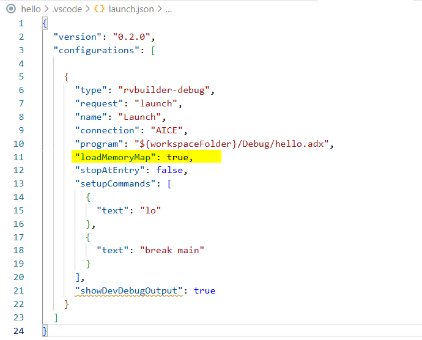

This section introduces the RVBuilder-specific interface and settings for software development with Andes RISC-V targets, as well as the components and tools included in the RVBuilder package.

## RVBuilder-Specific Interface 

### 1. RVBuilder Icon on the Activity Bar

   The RVBuilder icon serves as the entry point to the **RVBuilder** view.

### 2. RVBuilder View

   This view provides access to the RVBuilder **Home** page.

### 3. RVBuilder Home Page

   The RVBuilder **Home** page provides quick access to creating a new RVBuilder project or importing an RVBuilder demo project. It also includes links to reference documentation, technical support resources, and Andes Technology social media channels for developers who want to learn more.

   

### 4. RVBuilder Project Action Items 

   RVBuilder enables a set of project operations through an RVBuilder project pull-down menu or the **Explorer** view title menu to streamline the development workflow. 

   

   

   | Menu Item | Description |
   |---------|-------------|
   | RVBuilder: Build Project| Compiles the current project and generates the target binary/executable. |
   | RVBuilder: Clean Project | Removes all build artifacts generated during previous builds. |
   | RVBuilder: Delete Project | Deletes the selected RVBuilder project, including the configuration and source files. |
   | RVBuilder: Rebuild Project | Performs a clean operation followed by a full rebuild. |
   | RVBuilder: Debug | Starts debugging the currently active file or the selected project. |
   | RVBuilder: Settings | Opens the RVBuilder project settings for configuration and modification. |
   | RVBuilder: Flash Burner | Programs the generated project binary to the flash memory of a specified target.  |

## RVBuilder Settings in Workspace Configuration Files 
Projects configured with RVBuilder include specialized workspace settings required for development with Andes RISC-V targets. These settings are written to VS Code workspace configuration files in the `.vscode` folder under the project root directory. RVBuilder either automatically generates the workspace configuration files or patches existing ones to ensure the environment is optimized for Andes RISC-V development. 

Among the RVBuilder workspace settings, pay attention to the following: 

### `tasks.json`
For projects that use the Makefile automatically generated by RVBuilder (that is, the option **Use RVBuilder-generated Makefile** is selected in a project's [**Target Configuration**](./project_config.md#target-configuration)), the build task settings in the task configuration file are synchronized with the target configuration and build options specified in the project settings.

However, if the project uses a custom Makefile (i.e., the option **Use RVBuilder-generated Makefile** is unchecked in a project's [**Target Configuration**](./project_config.md#target-configuration)), changing the project toolchain requires you to manually update the toolchain executable paths in the file. Otherwise, build errors may occur. 

Note that a toolchain change is typically caused by a change in the selected chip profile. For more about toolchains in the RVBuilder package and their paths, see [**Toolchains**](./using_rvbuilder.md#toolchains).

### `launch.json`

Most workspace settings in this debug configuration file are generated automatically for Andes RISC-V development. By default, 

- the launch `type` is set to `rvbuilder-debug`.
- the `connection` type and `program` path are synchronized with the target configuration and build settings defined in the project settings. 
- the `loadMemoryMap` option is set to `true`, which loads the program executable according to the memory regions defined in the selected chip profile. To load the program executable without applying the predefined memory mapping, set this option to `false`.

    
    
You can further customize debugger behavior using the following options:

- `stopAtEntry` controls whether to halt execution at the program entry point when the debug session starts.
- `setupCommands` specifies debugger commands that are executed automatically at the start of the debug session.

## Components and Tools 
RVBuilder includes a set of components and tools that support the complete software development workflow for Andes RISC-V–based targets. These components provide predefined configurations and utilities required throughout development, including target configuration files (Chip Profiles), toolchains, the Linker Script Generator (LdSaG), and flash burners. 

The integration of these components within VS Code enables you to manage build, run and debug workflows through a unified interface, eliminating the need for manual installation and configuration of individual components for the desired Andes RISC-V target.

The following provide brief introduction to the key components and tools in the RVBuilder package.

### Chip Profiles 
Chip profiles describe the specifications and software configuration of specific target platforms. RVBuilder provides a set of predefined chip profiles for Andes RISC-V targets. Each chip profile contains the required software settings for the corresponding target, such as 

- the preferred toolchain
- compiler, linker, and assembler options specific to the target core
- target connection configuration and related arguments

When creating or configuring an RVBuilder project, select an appropriate chip profile to match the intended target and take note of the chip profile naming convention when making a selection.

The chip profiles follow the naming format:
> **`ADP-<PLATFORM>-<CORE>-<SUFFIX>`**

- `ADP` stands for Andes Development Platform. It is used as the prefix for Andes target configurations.
- **`<PLATFORM>`** refers to an AndeShape™ platform. Supported platform IPs or development platforms include: AE350 and Corvette-F1. For more information, see [AndeShape™ Platforms](https://www.andestech.com/en/products-solutions/andeshape-platforms/).
- **`<CORE>`** refers to a 32-bit or 64-bit AndesCore™ processor core. The RVBuilder package supports a variety of AndesCore processor series designed for different applications
For more information, see [AndesCore™ Processors](https://www.andestech.com/en/products-solutions/andescore-processors/).
- **`<SUFFIX>`** denotes additional features or configurations of the target. Supported suffixes include: 

    - `RVB` — Bit-manipulation extension enabled
    - `SE` — Security processor configuration
    - `1C` — Single-core configuration of a multi-core target
    - `SMP` — Symmetric multiprocessing configuration for multi-core targets

Examples of chip profiles within the RVBuilder Package include ADP-AE250-N25F, ADP-AE350-NX45-RVB, ADP-AE350-AX46MPV-SMP and more. 

### Toolchains
The RVBuilder package provides two toolchains, `nds32le-elf-newlib-v5` and `nds64le-elf-newlib-v5`, for software development on Andes RISC-V targets. Both toolchains are based on GNU and LLVM, and support the standard options of GCC, as, and ld, as well as clang and lld. They support compiler, assembler, and linker options specialized for Andes RISC-V targets to enable features such as performance tuning and code size optimization. For details on these Andes-specific compiler, assembler, and linker options, refer to [Andes Programming Guide](./ref/Andes_Programming_Guide_for_ISA_V5_PG012_V3.5.pdf).

Take note of the denotations in toolchain naming:

- `nds32`/`nds64` indicates the supported processor architecture. `nds32` for 32-bit Andes RISC-V processors and `nds64` for 64-bit Andes RISC-V processors.
- `le` indicates that the supported target endianness is little-endian.
- `elf` indicates the output binary format used by the compiler, assembler, and linker.  
- `newlib` indicates that the toolchain provides the Newlib support and can be compiled with either the GCC or LLVM compiler. 
- `v5` indicates that the toolchain targets the AndeStar™ Instruction Set Architecture (ISA) V5 implementation.

The appropriate toolchain for a specific Andes target is predefined in the associated chip profile and does not require manual selection. However, for RVBuilder projects that use a custom Makefile, you must update the target-related settings and toolchain paths in `tasks.json` after switching to a target (chip profile) with a different architecture (e.g. changing from 32-bit to 64-bit). The toolchain executable path is located at `${RVBUILDER_PACKAGE_ROOT}/toolchains/${TOOLCHAIN}/bin/`. 

### Linker Script Generator
The Linker Script Generator (LdSaG) is a tool that generates a linker script from a simplified image layout and memory mapping description file written in Andes Scattering-and-Gathering (SaG) format. Instead of writing complex GNU linker scripts, you can use the SaG syntax to describe the program image layout and memory mapping for Andes RISC-V targets. With the SaG-formatted description file (`*.sag`), the LdSaG tool generates a corresponding linker script.

For details about the SaG syntax and the command-line options for the LdSaG tool, see the chapter _Linker Script Generation_ in [Andes Programming Guide](./ref/Andes_Programming_Guide_for_ISA_V5_PG012_V3.5.pdf). 

### Flash Burners 

RVBuilder supports two approaches to perform in-system programming on Andes RISC-V real-board targets (i.e., Andes RISC-V targets connected via AICE, Maverick, or GDB server) . 

1. **Flash Burn** requires a flash burner, `PAR_burn` or `SPI_burn`, to communicate with ICEman using socket protocols. The `PAR_burn` utility programs parallel flash, while the `SPI_burn` utility programs SPI flash.

2. **Target Burn** requires the flash burner `target_burn_frontend` to communicate with ICEman using telnet protocols, along with a target application to program the flash memory directly. RVBuilder provides the target burn application `target_SPI_v5_32.bin` for programming flash on Andes 32-bit RISC-V targets and `target_SPI_v5_64.bin` for Andes RISC-V 64-bit targets. Compared with the **Flash Burn** approach, this approach accelerates the programming process.

The flash burners and target applications required for the above two programming approaches are included in the RVBuilder package. Their locations are as follows:

- Flash burner for **Flash Burn** or **Target Burn** (`PAR_burn`, `SPI_burn` and `target_burn_frontend`): `${RVBUILDER_PACKAGE_ROOT}/RVBuilder_1.0.0/flash/bin/`.
- target application for the **Target Burn** method (`target_SPI_v5_32.bin` or `target_SPI_v5_64.bin`): `${RVBUILDER_PACKAGE_ROOT}/RVBuilder_1.0.0/flash/target_bin/`.