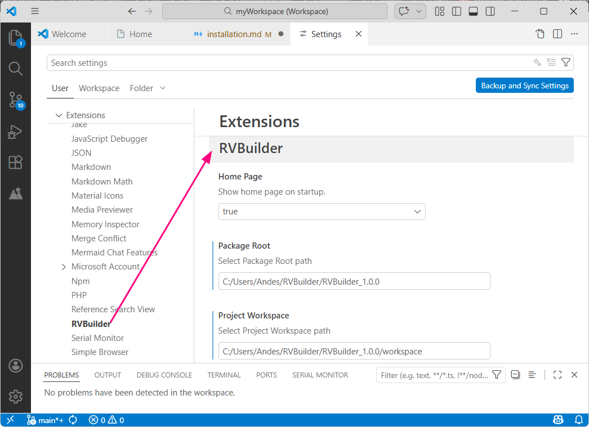
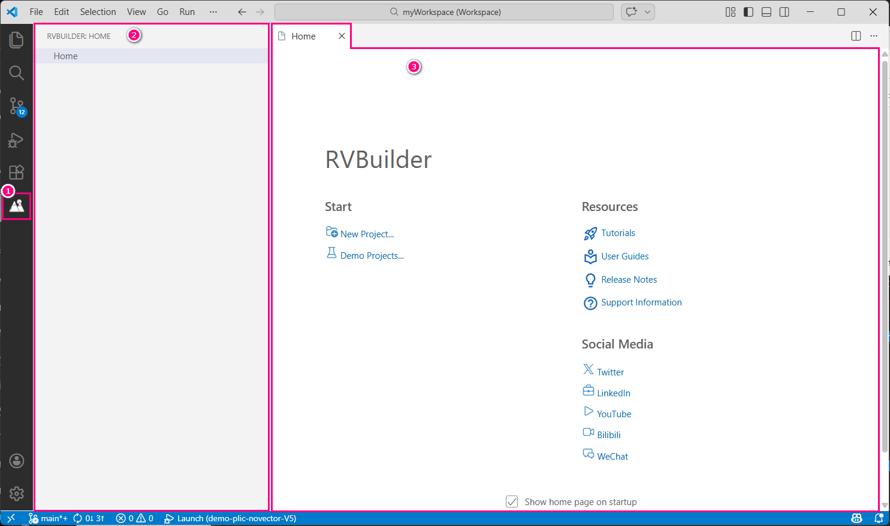

This section introduces the global settings of the RVBuilder extension in VS Code and the RVBuilder-specific interface designed to facilitate software development with Andes RISC-V processors.

# RVBuilder Configuration

Click  at the bottom of the **Activity Bar** and select **Settings**. Under the **User** tab, select **Extensions > RVBuilder** in the navigation pane to view the available RVBuilder extension settings and modify them if necessary. 

| Setting | Description |
|---------|-------------|
| Home Page| Controls whether the RVBuilder Home page is displayed when the VS Code starts. |
| Package Root | Specifies the installation destination of the RVBuilder package components.
| Project Workspace | Specifies the path to the project workspace.|

# RVBuilder-Specific Interface 

1. RVBuilder Icon on the Activity Bar

   The RVBuilder icon serves as the entry point to the RVBuilder view.

2. RVBuilder View

   This view provides access to the RVBuilder Home page.

3. RVBuilder Home Page

   The RVBuilder Home page provides quick access to creating a new RVBuilder project or importing an RVBuilder demo project. It also includes links to reference documentation, technical support resources, and Andes Technology social media channels for developers who want to learn more about Andes products and technologies.

4. RVBuilder Project Pull-down Menu Items 

5. RVBuilder Toolbar Buttons 